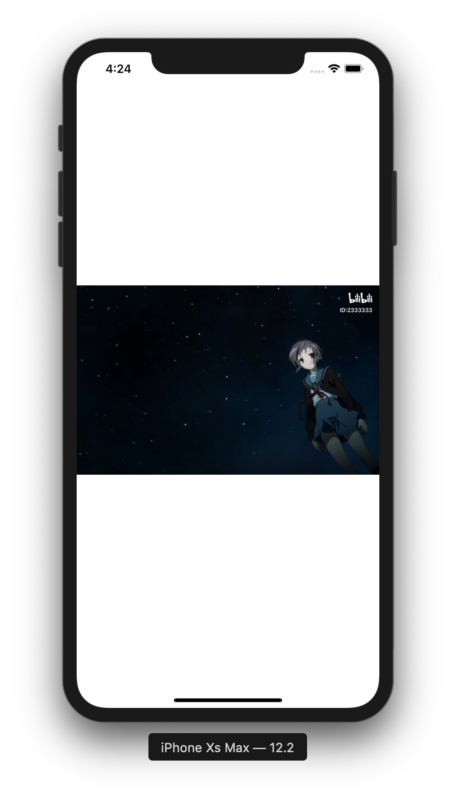

# Watermark

[](https://travis-ci.org/TBXark/Watermark)
[](https://cocoapods.org/pods/Watermark)
[](https://cocoapods.org/pods/Watermark)
[](https://cocoapods.org/pods/Watermark)

## Example

To run the example project, clone the repo, and run `pod install` from the Example directory first.



```swift
DispatchQueue.global().async {
    guard let bilibili = UIImage(named: "bilibili"),
        let image = UIImage(named: "demo") else {
        return
    }
    let attr = NSAttributedString(string: "ID:2333333", attributes: [
        NSAttributedStringKey.font : UIFont.boldSystemFont(ofSize: 16),
        NSAttributedStringKey.foregroundColor: UIColor.white])
    let processor =  WatermarkProcessor()
    var layout: WatermarkProcessor.Media.Position = (
        horizontal: (offset: 20, alignment: .end),
        vertical: (offset: 20, alignment: .start)
    )
    processor.addMedia(WatermarkProcessor.Media(image: bilibili, layout: layout))
    layout.vertical.offset += bilibili.size.height + 10
    processor.addMedia(WatermarkProcessor.Media(text: attr, layout: layout))
    guard let result = processor.process(origin: image) else {
        return
    }
    DispatchQueue.main.async {
        self.imageView.image = result
    }
}
```

## Requirements

## Installation

Watermark is available through [CocoaPods](https://cocoapods.org). To install
it, simply add the following line to your Podfile:

```ruby
pod 'Watermark', :git => 'https://github.com/TBXark/Watermark.git'
```

## Author

TBXark, tbxark@outlook.com

## License

Watermark is available under the MIT license. See the LICENSE file for more info.
